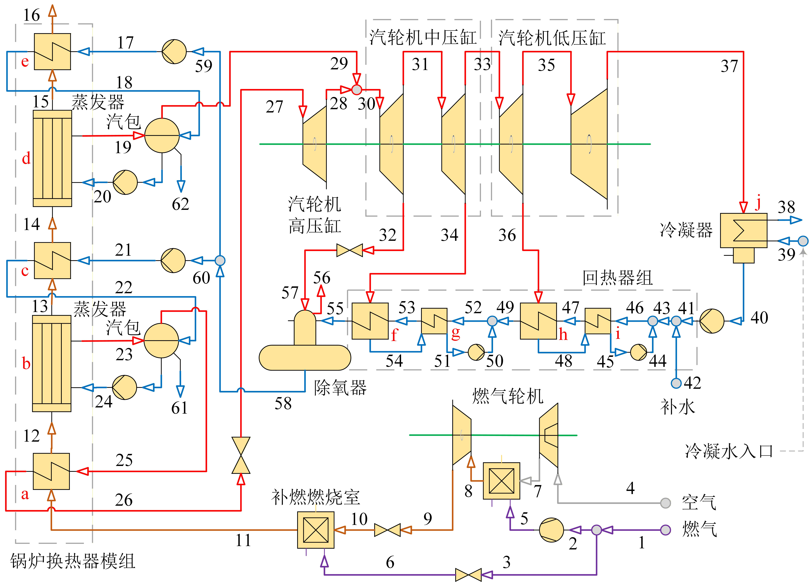
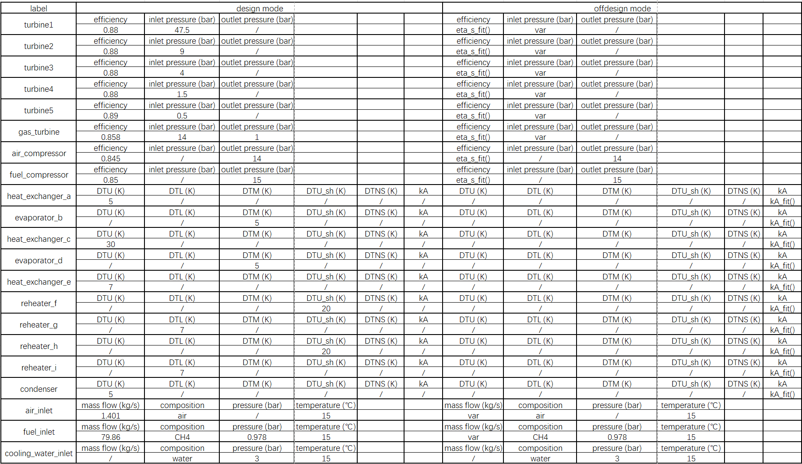
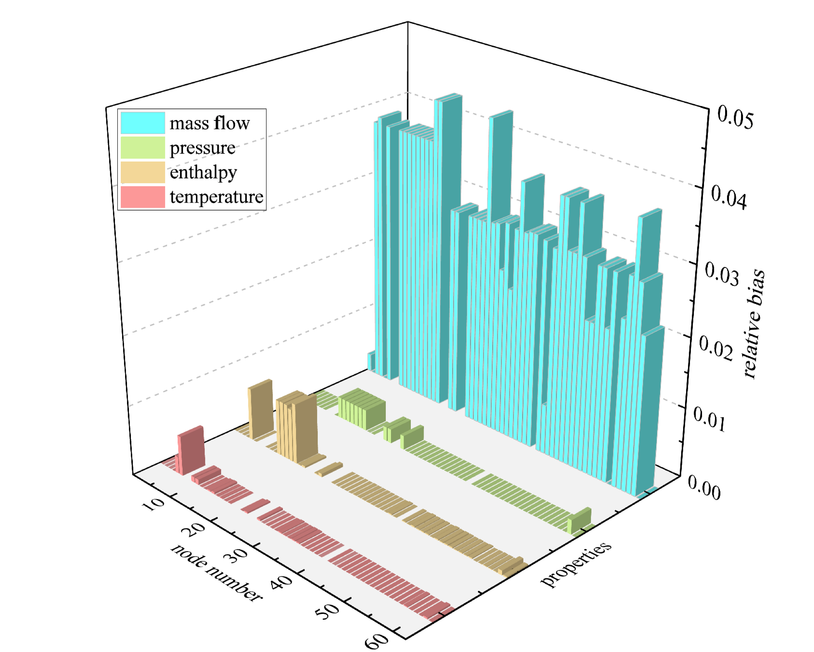
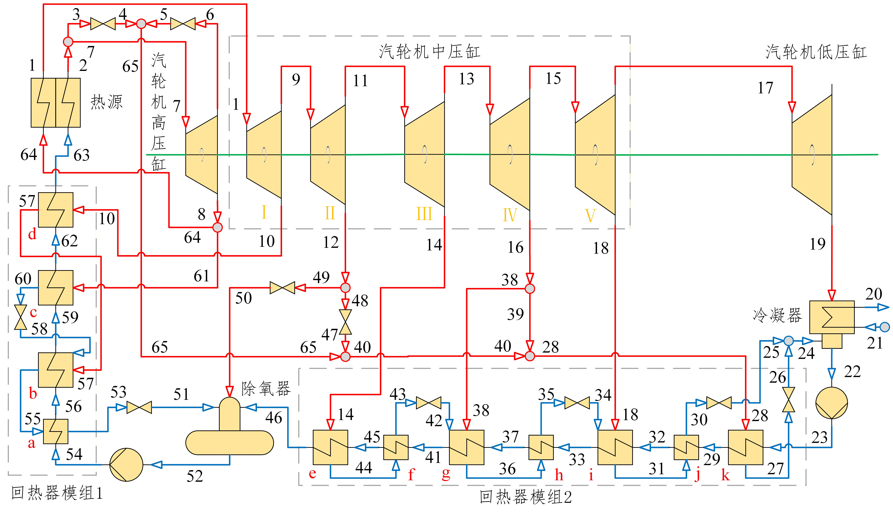
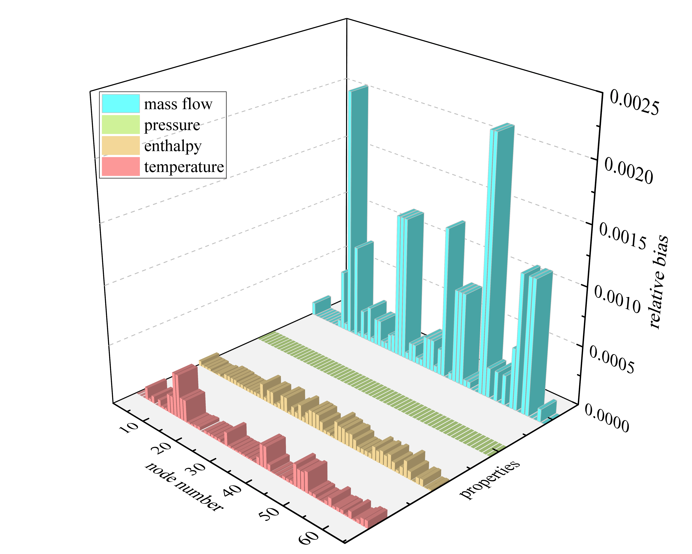

# Thermal System Simulation
(be updating)
## Catalog:
<!-- TOC -->
-[abstract](#)   
├─ 📂Aurora   ------------------------------------------------------------ program package   
│   ├─ 📂components  
│   │   ├─ 📂electric components  
│   │   │   ├─ 🐍electric component   
│   │   │   ├─    
│   │   │   └─    
│   │   ├─ 📂fluid components   
│   │   │   ├─ 🐍fluid component    
│   │   │   ├─ 📂heat exchangers   
│   │   │   │   ├─ 🐍heat exchangeer    
│   │   │   │   ├─ 🐍evaporator    
│   │   │   │   ├─ 🐍over heater    
│   │   │   │   ├─ 🐍condenser    
│   │   │   │   ├─ 🐍extract heat exchanger    
│   │   │   │   ├─ 🐍boiler simple    
│   │   │   │   └─ 🐍evaporator    
│   │   │   ├─ 📂deaerators   
│   │   │   └─ 📂turbomachinery   
│   │   └─   
│   ├─ 📂combines  
│   ├─ 📂controls  
│   │   └─ 🐍controller   
│   ├─ 📂connections  
│   │   ├─ 🐍connection   
│   │   ├─ 🐍electric connection   
│   │   ├─ 🐍fluid connection   
│   │   └─ 🐍bus   
│   ├─ 📂nodes  
│   │   ├─ 🐍node   
│   │   ├─ 🐍electric node   
│   │   └─ 🐍fluid node   
│   ├─ 📂networks  
│   │   ├─ 🐍network   
│   │   └─    
│   │  
│   │  
├─ 📂master model    ----------------------------------------------------- model   
│   ├─ 📂GasSteamCombinePlant  
│   │   ├─ 🐍combine plant model   
│   │   ├─ 📄log   
│   │   ├─ 📊design data   
│   │   ├─ 📊offdesign data  
│   │   └─ 🖼image   
│   ├─ 📂PureSteamPlant  
│   │   ├─ 🐍pure steam plant model   
│   │   ├─ 📄log   
│   │   ├─ 📊design data   
│   │   ├─ 📊offdesign data  
│   │   └─ 🖼image   
│   └─ 📂

<!-- TOC -->

## Examples:
1. GasSteamCombinePlant

The thermal model in my paper is in GasSteamCombineCyclePlantModel1.py at combine_plant of master_model, which is a gas-steam combine cycle.
The properties set are as follows:

The relative bias of design condition with commercial software is as follows:

2. PureSteamPlant

Another model is PureSteamPlant, which has complex topology constructure. The energy comes from the BoilerSimple. 
The relative bias of design condition with commercial software is as follows: 

3. SolarThermalCombinePlant

## Explanation:
The fundamental fluid-property solving-equation (like, h(p, T)) is invoked from Tespy, saving time for constructing fluid solving engine.
Thanks for open source library Tespy, the framework of which has given some reference for us.
Our research comes from the limitation of the application of Tespy.
To solve these problems in thermal systems, we spent a year repeatedly trying and finally found a successful path.
